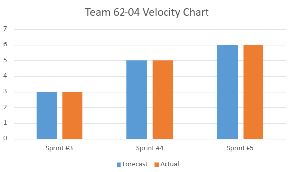

**Spring Quarter 2025**  

**Sprint # 5**  
We will be using a burndown chart and a velocity chart for this sprint. Approved by Scrum Master.

{width=500 height=283}
{width=500 height=283}
{width=500 height=283}
{width=500 height=283}

**Sprint # 4**  
We will be using a burndown chart and a velocity chart for this sprint. Approved by Scrum Master.

{width=500 height=283}

{width=500 height=283}

{width=500 height=283}

{width=500 height=283}

**Sprint # 3**  
Team Goal for Next Sprint: Look at Kanban board every day to identify tasks that need to be reviewed sooner.

We will be implementing a burndown chart and a velocity chart. Approved by Scrum Master.

{width=500 height=283}

{width=500 height=283}

{width=500 height=283}

{width=500 height=283}

**Winter Quarter 2025**  
{width=500 height=283}

{width=500 height=283}

{width=500 height=283}