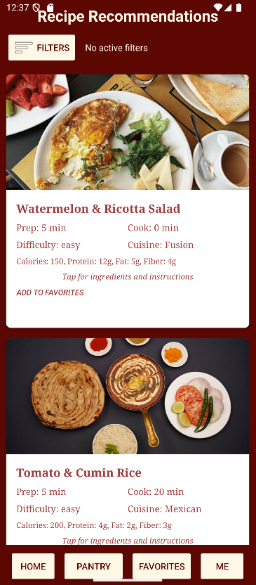

### **How to Start the System**
Users can start the system by running the app in Android Studio.

### **How to Use System Features**

Log In: Type existing email address and password into corresponding fields. Then press "Log In" button. If you need to create an account, press the "Sign Up" button to register a new account.

Add to Pantry of Ingredients: Click the "Pantry" menu button at the bottom of the screen. Type ingredients into search bar, and then select the most relevant option. Use "Clear" button and swipe to remove individual ingredients as needed.

View Recipes: When there are ingredients in your pantry, you can click the "See All Recipes" button located inside the pantry page to view the recipes that only require the ingredients you have available. Tap on the recipe cards to view more details on the back.

Filter Recipes: Click on the "Filters" button at the top of the page with all the recipes to make filtering selections. Drag the sliders, select from multiple choice options, and press the dropdown to be able to make all selections. Click "Apply" to filter the recipes, and click "Reset" to remove any existing filters.

Add/Remove Favorite Recipes: Click "Add to Favorites" at the bottom of each recipe card to add that individual recipe to your favorites. Navigate to your favorites page by pressing the "Favorites" menu button at the bottom of the screen. Remove recipes from favorites by pressing the "Remove from Favorites" button at the bottom of the recipe card.

Change Username & Profile Picture: Navigate to your personal profile by pressing the "Me" menu button at the bottom of the screen. Click the "UserName" field and begin typing to change your username. Click on your profile picture, and select a new one using the pop-up connected to your photos.

### **Screenshots of Main Features**
{width=224 height=504}
{width=220 height=503}
{width=219 height=500}
{width=222 height=500}
{width=224 height=500}

### **Example Inputs & Outputs**
Typing ingredients into search bar and then selecting some results in:
{width=158 height=263}

Clicking "See All Recipes" button results in:
{width=219 height=500}

Clicking "Add to Favorites" on a recipe card results in:
{width=224 height=500}